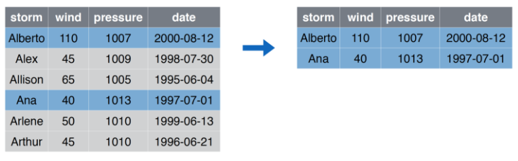
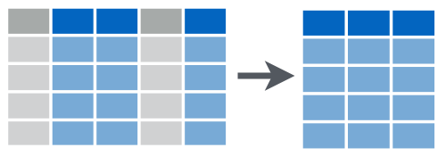
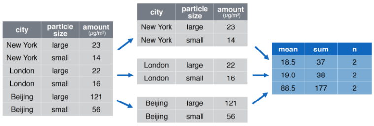

```{r setup, include=FALSE}
source(here::here("R/00-xaringan-knitr-setup.R"))

library(dplyr)

storms <- readr::read_csv(here::here("data/storms.csv"))
pollution <- readr::read_csv(here::here("data/pollution.csv"))
```

## Transformación de datos

> La visualización es una herramienta importante para la generación de conocimiento; sin embargo, es raro que obtengas los datos exactamente en la forma en que los necesitas. A menudo tendrás que crear algunas variables nuevas o resúmenes, o tal vez solo quieras cambiar el nombre de las variables o reordenar las observaciones para facilitar el trabajo con los datos.

Lo anterior es un _copy & paste_ desde [R4DS](https://es.r4ds.hadley.nz/transform.html).

---

## `dplyr` Lo básico

En este capítulo, aprenderás las cinco funciones clave de **dplyr** que te permiten resolver la gran mayoría de tus desafíos de manipulación de datos:

* Filtrar o elegir las observaciones por sus valores (`filter()` — del inglés filtrar).
* Reordenar las filas (`arrange()` — del inglés organizar).
* Seleccionar las variables por sus nombres (`select()` — del inglés seleccionar).
* Crear nuevas variables con transformaciones de variables existentes (`mutate()` — del inglés mutar o transformar).
* Contraer muchos valores en un solo resumen (`summarise()` — del inglés resumir).

Todas estas funciones se pueden usar junto con `group_by()` (del inglés _agrupar por_), que cambia el alcance de cada función para que actúe ya no sobre todo el conjunto de datos sino de grupo en grupo.

---

## `dplyr` Lo básico (2)

Todos los verbos funcionan de manera similar:

1. El primer argumento es un *data frame*.

2. Los argumentos posteriores describen qué hacer con el *data frame* usando los nombres de las variables (sin comillas).

3. El resultado es un nuevo *data frame*.

En conjunto, estas propiedades hacen que sea fácil encadenar varios pasos simples para lograr un resultado complejo.

Nuevamente, lo anterior es un _copy & paste_ desde [R4DS](https://es.r4ds.hadley.nz/transform.html).

---

background-image: url(images/dplyr/dplyr_filter.jpg)
background-size: cover

---

## `filter` Seleccionar Filas

```{r out.width='70%', fig.align='center', echo=FALSE}
knitr::include_graphics("images/dplyr/filter.png")
```

---

## `filter` ejemplo

```{r out.width='70%', fig.align='center', echo=FALSE}

```

---

`r flipbookr::chunk_reveal("filter", title = "## <code>filter</code> Código", widths = c(1, 1))`

```{r filter, include = FALSE}
storms |>
  filter(storm %in% c("Alberto", "Ana"))
```

---

## `select` Seleccionar Columnas

```{r out.width='70%', fig.align='center', echo=FALSE}

```

---

## `select` ejemplo

```{r out.width='70%', fig.align='center', echo=FALSE}
knitr::include_graphics("images/dplyr/select_example.png")
```

---

`r flipbookr::chunk_reveal("select", title = "## <code>select</code> Código", widths = c(1, 1))`

```{r select, include = FALSE}
storms |>
  select(storm, pressure)
```

---

## `arrange` Ordenar Filas

```{r out.width='70%', fig.align='center', echo=FALSE}
knitr::include_graphics("images/dplyr/arrange.png")
```

---

## `arrange` ejemplo

```{r out.width='70%', fig.align='center', echo=FALSE}
knitr::include_graphics("images/dplyr/arrange_example.png")
```

---

`r flipbookr::chunk_reveal("arrange", title = "## <code>arrange</code> Código", widths = c(1, 1))`

```{r arrange, include = FALSE}
storms |>
  arrange(wind)
```

---

background-image: url(images/dplyr/dplyr_mutate.png)
background-size: contain

---

## `mutate` Crear (o transformar) Columnas

```{r out.width='70%', fig.align='center', echo=FALSE}
knitr::include_graphics("images/dplyr/mutate.png")
```

---

## `mutate` ejemplo

```{r out.width='70%', fig.align='center', echo=FALSE}
knitr::include_graphics("images/dplyr/mutate_example.png")
```

---

`r flipbookr::chunk_reveal("mutate", title = "## <code>mutate</code> Código", widths = c(1, 2))`

```{r mutate, include = FALSE}
storms |> 
  mutate(
    ratio = pressure/wind,
    inverse = 1/ratio
    ) |> 
  mutate(wind = log(wind))
```

---

## `summarise` Resumir Columnas

```{r out.width='70%', fig.align='center', echo=FALSE}
knitr::include_graphics("images/dplyr/summarise.png")
```

---

## `summarise` ejemplo

```{r out.width='70%', fig.align='center', echo=FALSE}
knitr::include_graphics("images/dplyr/summarise_example.png")
```

---

`r flipbookr::chunk_reveal("summarise", title = "## <code>summarise</code> Código", widths = c(1, 1))`

```{r summarise, include = FALSE}
pollution |>
  summarise(median = median(amount))
```

---


## `group_by |> summarise` Resumir Columnas por Grupos

```{r out.width='70%', fig.align='center', echo=FALSE}
knitr::include_graphics("images/dplyr/group_by_summarize.png")
```

---

## `group_by |> summarise` ejemplo

```{r out.width='70%', fig.align='center', echo=FALSE}

```

---

`r flipbookr::chunk_reveal("group_by", title = "## <code>group_by |> summarise</code> Código", widths = c(1, 1))`

```{r group_by, include = FALSE}
pollution %>%
  group_by(city) |>
  summarise(
    mean = mean(amount),
    sum = sum(amount),
    n = n()
  )
```


---

`r flipbookr::chunk_reveal("group_by_spanish", title = "## <code>group_by |> summarise</code> Código <small>(spanish version)</small>", widths = c(1, 1))`

```{r group_by_spanish, include = FALSE}
pollution %>%
  group_by(city) |>
  summarise(
    promedio = mean(amount),
    suma = sum(amount),
    conteo = n()
  )
```


---


## Ejercicio: en un script de R:

1. Cargue el paquete `tidyverse`.
1. Cree un data frame con columnas `x` e `y`, cada una de las columnas
sea 1000 números aleatorios entre -1 y 1 (recuerde la función `runif`).
1. Genere un gráfico de puntos visualizando como se relacionan las variables `x` e `y`.
1. Con la función `mutate` cree una variable  `r` que sea igual a `x^2 + y^2`, es decir $x^2 + y^2$.
1. Utilize la función `if_else` con el fin de generar una cuarta variable que si `r` es mayor que 1 entonces asigne el valor "A", en caso contrario "B". Llame esta variable como `r2`.
1. Ahora vuelva generar el gráfico de 3. pero coloreando el punto de acuerdo a la variable `r2`.
1.  Utilice el _combo_ `group_by(r2) |> summarise(...)` para contar cuantos son "A" y "B", y generar la columna `p = n/sum(n)`. 


---

## Más información sobre transformación de datos

- [Transformación de datos](https://es.r4ds.hadley.nz/transform.html) en R4DS.

- [Tidy data tutor](https://tidydatatutor.com/vis.html), visualizar _pipelines_ de 
transformación de datos.


