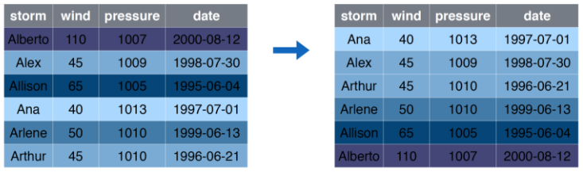

```{r setup, include=FALSE}
source(here::here("R/00-xaringan-knitr-setup.R"))

library(dplyr)

storms <- readr::read_csv(here::here("data/storms.csv"))
pollution <- readr::read_csv(here::here("data/pollution.csv"))
```

## Transformación de datos

> La visualización es una herramienta importante para la generación de conocimiento; sin embargo, es raro que obtengas los datos exactamente en la forma en que los necesitas. A menudo tendrás que crear algunas variables nuevas o resúmenes, o tal vez solo quieras cambiar el nombre de las variables o reordenar las observaciones para facilitar el trabajo con los datos.

Lo anterior es un _copy & paste_ desde [R4DS](https://es.r4ds.hadley.nz/transform.html).

---

## `dplyr` Lo básico

En este capítulo, aprenderás las cinco funciones clave de **dplyr** que te permiten resolver la gran mayoría de tus desafíos de manipulación de datos:

* Filtrar o elegir las observaciones por sus valores (`filter()` — del inglés filtrar).
* Reordenar las filas (`arrange()` — del inglés organizar).
* Seleccionar las variables por sus nombres (`select()` — del inglés seleccionar).
* Crear nuevas variables con transformaciones de variables existentes (`mutate()` — del inglés mutar o transformar).
* Contraer muchos valores en un solo resumen (`summarise()` — del inglés resumir).

Todas estas funciones se pueden usar junto con `group_by()` (del inglés _agrupar por_), que cambia el alcance de cada función para que actúe ya no sobre todo el conjunto de datos sino de grupo en grupo.

---

## `dplyr` Lo básico (2)

Todos los verbos funcionan de manera similar:

1. El primer argumento es un *data frame*.

2. Los argumentos posteriores describen qué hacer con el *data frame* usando los nombres de las variables (sin comillas).

3. El resultado es un nuevo *data frame*.

En conjunto, estas propiedades hacen que sea fácil encadenar varios pasos simples para lograr un resultado complejo.

Nuevamente, lo anterior es un _copy & paste_ desde [R4DS](https://es.r4ds.hadley.nz/transform.html).

---

background-image: url(images/dplyr/dplyr_filter.jpg)
background-size: cover

---

## `filter` Seleccionar Filas

```{r out.width='70%', fig.align='center', echo=FALSE}
knitr::include_graphics("images/dplyr/filter.png")
```

---

## `filter` ejemplo

```{r out.width='80%', fig.align='center', echo=FALSE}
knitr::include_graphics("images/dplyr/filter_example.png")
```

---

`r flipbookr::chunk_reveal("filter", title = "## <code>filter</code> Código", widths = c(1, 1))`

```{r filter, include = FALSE}
storms |>
  filter(storm %in% c("Alberto", "Ana"))
```

---

## `select` Seleccionar Columnas

```{r out.width='70%', fig.align='center', echo=FALSE}
knitr::include_graphics("images/dplyr/select.png")
```

---

## `select` ejemplo

```{r out.width='80%', fig.align='center', echo=FALSE}
knitr::include_graphics("images/dplyr/select_example.png")
```

---

`r flipbookr::chunk_reveal("select", title = "## <code>select</code> Código", widths = c(1, 1))`

```{r select, include = FALSE}
storms |>
  select(storm, pressure)
```

---

## `arrange` Ordenar Filas

```{r out.width='70%', fig.align='center', echo=FALSE}
knitr::include_graphics("images/dplyr/arrange.png")
```

---

## `arrange` ejemplo

```{r out.width='80%', fig.align='center', echo=FALSE}

```

---

`r flipbookr::chunk_reveal("arrange", title = "## <code>arrange</code> Código", widths = c(1, 1))`

```{r arrange, include = FALSE}
storms |>
  arrange(wind)
```

---

background-image: url(images/dplyr/dplyr_mutate.png)
background-size: contain

---

## `mutate` Crear (o transformar) Columnas

```{r out.width='70%', fig.align='center', echo=FALSE}
knitr::include_graphics("images/dplyr/mutate.png")
```

---

## `mutate` ejemplo

```{r out.width='80%', fig.align='center', echo=FALSE}
knitr::include_graphics("images/dplyr/mutate_example.png")
```

---

`r flipbookr::chunk_reveal("mutate", title = "## <code>mutate</code> Código", widths = c(1, 2))`

```{r mutate, include = FALSE}
storms |> 
  mutate(
    ratio = pressure/wind,
    inverse = 1/ratio
    ) |> 
  mutate(wind = log(wind))
```

---

## `summarise` Resumir Columnas

```{r out.width='70%', fig.align='center', echo=FALSE}
knitr::include_graphics("images/dplyr/summarise.png")
```

---

## `summarise` ejemplo

```{r out.width='80%', fig.align='center', echo=FALSE}
knitr::include_graphics("images/dplyr/summarise_example.png")
```

---

`r flipbookr::chunk_reveal("summarise", title = "## <code>summarise</code> Código", widths = c(1, 1))`

```{r summarise, include = FALSE}
pollution |>
  summarise(median = median(amount))
```

---


## `group_by |> summarise` Resumir Columnas por Grupos

```{r out.width='70%', fig.align='center', echo=FALSE}
knitr::include_graphics("images/dplyr/group_by_summarize.png")
```

---

## `group_by |> summarise` ejemplo

```{r out.width='80%', fig.align='center', echo=FALSE}
knitr::include_graphics("images/dplyr/group_by_summarize_example.png")
```

---

`r flipbookr::chunk_reveal("group_by", title = "## <code>group_by |> summarise</code> Código", widths = c(1, 1))`

```{r group_by, include = FALSE}
pollution |> 
  group_by(city) |>
  summarise(
    mean = mean(amount),
    sum = sum(amount),
    n = n()
  )
```


---

`r flipbookr::chunk_reveal("group_by_spanish", title = "## <code>group_by |> summarise</code> Código <small>(spanish version)</small>", widths = c(1, 1))`

```{r group_by_spanish, include = FALSE}
pollution |> 
  group_by(city) |>
  summarise(
    promedio = mean(amount),
    suma = sum(amount),
    conteo = n()
  )
```


---


## Ejercicio: en un script de R:

<small>

1. Cargue el paquete `tidyverse`, y cree un data frame con columnas `x` e `y`, cada una de las columnas
sea 1000 números aleatorios entre -1 y 1 (recuerde la función `runif`).
1. Genere un gráfico de puntos visualizando como se relacionan las variables `x` e `y`.
1. Con la función `mutate` cree una variable  `r` que sea igual a `x^2 + y^2`, es decir $x^2 + y^2$.
1. Utilize la función `if_else` (y `mutate`) para generar una cuarta variable cuya definición es: si `r` es mayor que 1 entonces vale "A", en caso contrario "B". Llame esta variable como `r2`.
1. Ahora vuelva generar el gráfico de 3. pero coloreando el punto de acuerdo a la variable `r2`.
1. Utilice el _combo_ `group_by(r2) |> count()` para contar cuantos son "A" y "B", y luego generar la columna `p = n/sum(n)`. 
1. Cree la columna `es_b` que indique con un 1 si el valor de `r2` es "B" y 0 si es "A", para luego
crear la columna `convergencia` al aplicar la función `cummean` a la columna `es_b`.
1. con ayuda de la función `row_number()` genere la columna `fila` y haga un gráfico de líneas 
con `x = fila` e `y = 4 * convergencia`.
</small>


---


`r flipbookr::chunk_reveal("solucion", title = "## Posible solución", widths = c(1, 1))`

```{r solucion, include = FALSE}
library(tidyverse)

set.seed(123)

df <- tibble(
  x = runif(1000, -1, 1),
  y = runif(1000, -1, 1)
)

df |> 
  mutate(r = x^2 + y^2) |> 
  mutate(r2 = if_else(r > 1, "A", "B")) |> 
  mutate(es_b = if_else(r2 == "B", 1, 0)) |> 
  mutate(conv = cummean(es_b)) |> 
  mutate(fila = row_number()) 
```

---


`r flipbookr::chunk_reveal("solucion2", title = "## Posible solución v2", widths = c(1, 1), chunk_options = "fig.height = 2.7, fig.width = 3")`

```{r solucion2, include = FALSE}
library(tidyverse)

set.seed(123)

df <- tibble(
  x = runif(10000, -1, 1),
  y = runif(10000, -1, 1)
)

df |> 
  mutate(
    r = x^2 + y^2,
    ri = r < 1,
    conv = cummean(ri),
    row = row_number()
    ) |> 
  ggplot() +
  geom_line(aes(row, 4 * conv)) +
  geom_hline(yintercept = pi, color = "darkred") 
```

---

`r flipbookr::chunk_reveal("solucion3", title = "## Posible solución v3", widths = c(1, 1), chunk_options = "fig.height = 2.7, fig.width = 3")`

```{r solucion3, include = FALSE}
library(tidyverse)

set.seed(123)

tibble(
  x = runif(10000, -1, 1),
  y = runif(10000, -1, 1)
) |> 
  mutate(
    r = x^2 + y^2,
    ri = r < 1,
    conv = cummean(ri),
    row = row_number()
  ) |> 
  ggplot() +
  geom_line(aes(row, 4 * conv)) +
  geom_hline(yintercept = pi, color = "darkred") +
  scale_x_continuous(labels = scales::comma_format()) +
  scale_y_continuous(
    sec.axis = sec_axis(trans = ~., breaks = pi, labels = expression(pi))
  )
```

---
  
## El Pipe (_paip_) `|>`
  
Los pipes son una herramienta poderosa para expresar claramente una secuencia de múltiples operaciones. Hasta aquí, has venido usándolos sin saber cómo funcionan o qué alternativas existen. En este capítulo ya es tiempo de explorarlos en más detalle. En él aprenderás qué alternativas existen, cuándo no deberías utilizarlos y algunas herramientas útiles relacionadas.

De forma general veremos que `z |> f()` es equivalente a `f(z)` y en el caso 
de aplicar parámetros extras tenemos que `z |> g(y)` es `g(x, y)`.

En el próximo ejemplo veremos que el **pipe** (`|>` o `%>%`) ayuda a la 
legibilidad del código.

Más en el capítulo [Pipes](https://es.r4ds.hadley.nz/pipes.html) en R4DS.


---

`r flipbookr::chunk_reveal("pipe", title = "## Ejemplo pipe", widths = c(1, 1))`

```{r pipe, include = FALSE, echo=FALSE}
x <- 34

tan(cos(sqrt(log(x))))

y <- x
y <- log(y)
y <- sqrt(y)
y <- cos(y)
y <- tan(y)
y

x |> 
  log() |> 
  sqrt() |> 
  cos() |> 
  tan()
```

---

## Ejercicio en grupo! Un solo grupo!

1. Cargue **tidyverse** y el paquete **datos**.

1. Explore las tablas `vuelos`, `aeropuertos`, y `aerolineas`. Represente en un mapa los distintos vuelos realizados enfatizando los más usuales.

1. **Avanzado**: Utilice los paquete `ggforce` y `edgebundle` para replicar
lo realizado en el ejericio anterior utizando como _template_ el ejemplo
mostrado en https://github.com/schochastics/edgebundle.

1. Estudie los datos (como hoy es 4 de mayo) `starwars` del paquete `dplyr`. 
Haga un gráfico de estatura peso utilizando puntos y graficando un posible 
modelo con `geom_smooth()`. _Póngale color_, de verdad, utilice el
paquete `showtext` para tematizar el gráfico.

---

## Más información sobre transformación de datos

- [Transformación de datos](https://es.r4ds.hadley.nz/transform.html) en R4DS.

- [Tidy data tutor](https://tidydatatutor.com/vis.html), visualizar _pipelines_ de 
transformación de datos.


