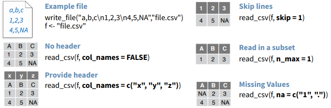
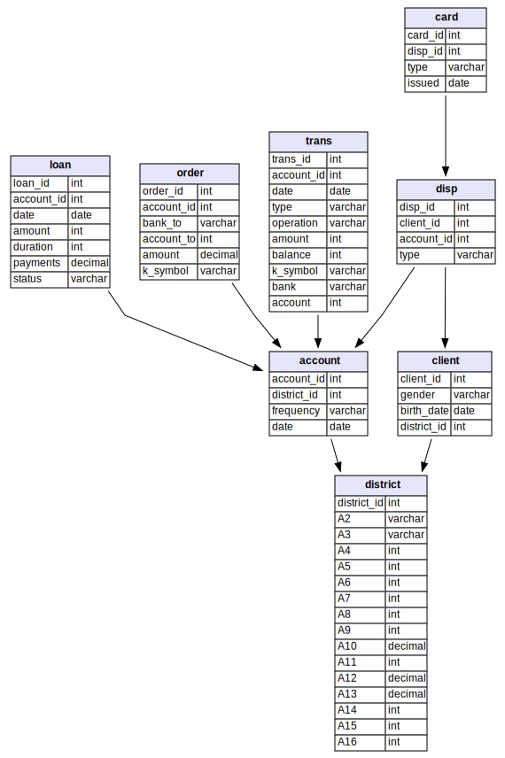

```{r setup, include=FALSE}
source(here::here("R/00-xaringan-knitr-setup.R"))
```

class: inverse center middle

# Ingesta de datos

---

## Orígenes de información

Los datos puden venir de muchas fuentes:

- Archivo de texto.
  https://raw.githubusercontent.com/jbkunst/usach-ingemat-intro-elementos-ds-202201/main/data/pollution.csv
- Planillas, archivos excel.
- SPSS (?).
- Bases de Datos. Esto es todo un mundo, existen muchos motores de bases de datos.
- Desde una página web: https://www.reclamos.cl/empresa/uber-eats
- Una API: https://climatologia.meteochile.gob.cl/application/productos/datosRecientesEma/330020/2022/05
  
---
  
## `paquete::funcion` para cada tipo de origen

Origen  | `paquete::funcion`
--------|---------
`xlsx`  |  `readxl::read_excel`
`txt`   |  `readr::read_delim` / `data.table::fread`
`csv`   |  `readr::read_csv` / `data.table::fread`
Bases de datos   | Paquete `dbplyr`
Archivo SPSS`sav`|  `haven::read_sav`
API              |  `httr::GET`
Página web       |  `rvest::read_html`

En general Bases de datos es más general dado que existen distintos motores de bases
de datos. Más info en https://dbplyr.tidyverse.org/articles/dbplyr.html

---

## `read_csv` / `read_delim`

```{r out.width='70%', fig.align='center', echo=FALSE}
knitr::include_graphics("images/readr/readr.png")
```

---

## `read_csv` / `read_delim` parámetros

<br/>

```{r out.width='70%', fig.align='center', echo=FALSE}

```


---

`r flipbookr::chunk_reveal("read_excel", title = "## <code>readxl::read_excel</code>", widths = c(1, 1))`

```{r read_excel, include = FALSE}
library(readxl)

ruta <- here::here("data/muestrame_los_numeros.xlsx")

ruta

read_excel(ruta)
```

---

`r flipbookr::chunk_reveal("read_csv", title = "## <code>readr::read_csv</code>", widths = c(1, 1))`

```{r read_csv, include = FALSE}
library(readr)

ruta <- here::here("data/pollution.csv")

ruta

read_csv(ruta)
```

---

`r flipbookr::chunk_reveal("GET", title = "## <code>httr::GET</code>", widths = c(1, 1), chunk_options = "fig.height = 2.7, fig.width = 3")`

```{r GET, include = FALSE}
library(httr)
library(tidyverse) # dplyr + ggplot + etc
library(chilemapas) # gracias Pachá!

url <- "https://api.gael.cloud/general/public/sismos"

httr::GET(url) |>
  content() |>
  purrr::map_df(tibble::as_tibble) |>
  mutate(across(everything(), readr::parse_guess)) |>
  mutate(Magnitud = as.numeric(stringr::str_remove(Magnitud, "Ml"))) |>
  ggplot() +
  geom_sf(
    data = chilemapas::mapa_comunas, aes(geometry = geometry),
    alpha = 0.5, size = 0.3
    ) +
  geom_point(
    aes(x = Longitud, y = Latitud, size = Magnitud),
    shape = 21, fill = "gray80", color = "gray60",
    ) +
  coord_sf(xlim = c(-80, NA)) +
  theme_minimal()
```

---

`r flipbookr::chunk_reveal("dbplyr", title = "## Bases de datos <code>dbplyr</code>", widths = c(1, 1))`

```{r dbplyr, include = FALSE}
library(dplyr)
library(dbplyr)
library(DBI)
library(RMariaDB)

con <-  dbConnect(
  RMariaDB::MariaDB(),
  host = "mysql-rfam-public.ebi.ac.uk",
  db = "Rfam", 
  user = "rfamro",
  port = 4497
  )

tbl(con, "taxonomy") |> 
  select(ncbi_id, species, tax_string) |> 
  filter(ncbi_id == 10116) |> 
  show_query() |> 
  collect()
```

---

`r flipbookr::chunk_reveal("dbplyr2", title = "## Bases de datos <code>dbplyr</code> ejemplo 2", widths = c(1, 1))`


```{r dbplyr2, include=FALSE}
library(tidyverse)
# Postres SQL es otro motor de bbdd
library(RPostgres)

# gracias Pachá nuevamente!
user <- "student"
pass <- "uQCy30sNP5arqMBGHVLZ"

con <- dbConnect(
  Postgres(),
  user = user,
  password = pass,
  dbname = "financial",
  host = "databases.pacha.dev"
)

dbListTables(con)
```

---

## Más detalles de la BBDD

https://relational.fit.cvut.cz/dataset/Financial

```{r out.width='27%', fig.align='center', echo=FALSE}

```


---

`r flipbookr::chunk_reveal("dbplyr3", title = "## Bases de datos <code>dbplyr</code> ejemplo 2", widths = c(1, 1), chunk_options = "fig.height = 2.7, fig.width = 3")`


```{r dbplyr3, include=FALSE}
tbl(con, "loans") |> 
  group_by(duration) |> 
  summarise(
    promedio_monto = mean(amount),
    cantidad_de_operacion = n()
  ) |> 
  arrange(duration) |> 
  collect() |> 
  mutate(across(everything(), as.numeric)) |> 
  ggplot() +
  geom_col(
    aes(
      x = factor(duration),
      y = cantidad_de_operacion)
    )
```

---


`r flipbookr::chunk_reveal("rvest", title = "## HTML <code>rvest::read_html</code>", widths = c(1, 1), chunk_options = "fig.height = 2.7, fig.width = 3")`


```{r rvest, include=FALSE}
library(rvest)
library(lubridate)

url <- "https://www.reclamos.cl/empresa/universidad_de_santiago_usach"

read_html(url) |> 
  html_table() |> 
  first() |> 
  set_names(c("fecha", "reclamo", "cantidad")) |> 
  mutate(fecha = dmy(fecha)) |> 
  arrange(fecha, cantidad) |> 
  ggplot(aes(fecha, cantidad)) +
  geom_line(color = "gray80", size = 1.2) +
  geom_smooth(alpha = 0.25, size = 1.2) +
  geom_vline(xintercept = ymd(20160401), color = "darkred", size = 1.2) +
  geom_text(
    x = ymd(20170401), y = 4000, hjust = -.05,
    label = "Primer curso\nIntro DS <3"
    ) +
  coord_cartesian(ylim = c(0, NA))
```

